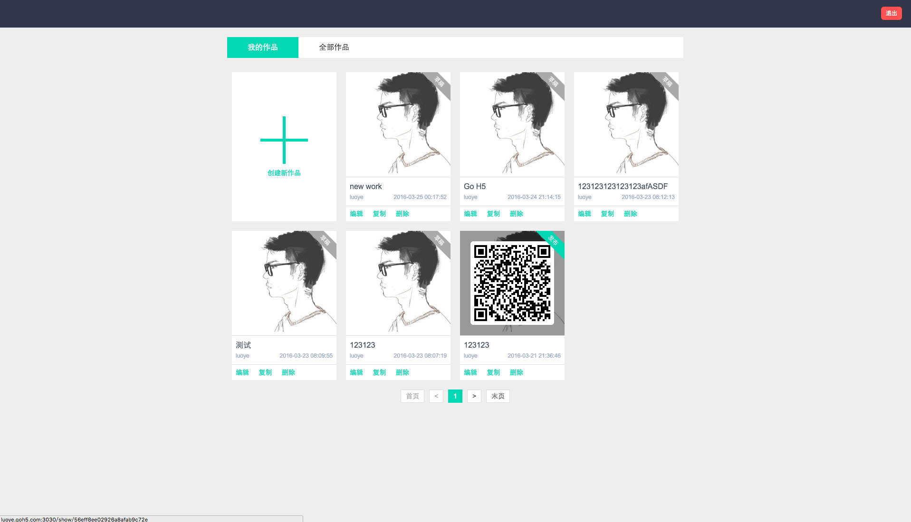
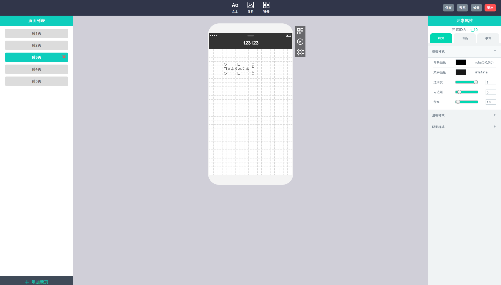
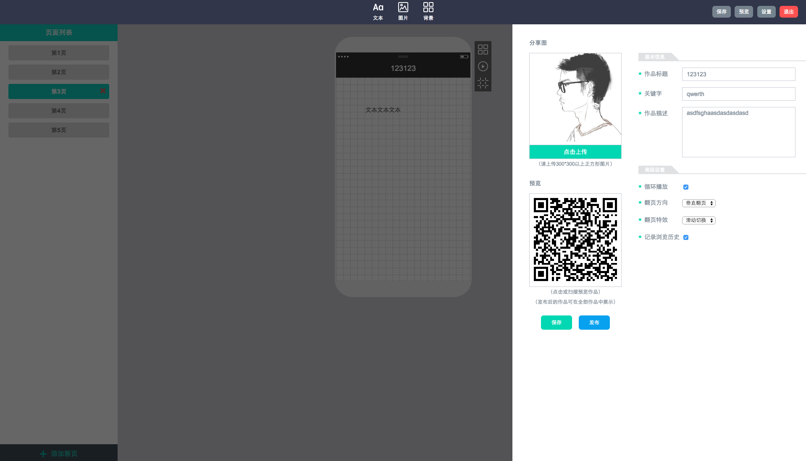

H5Platform
================

H5Platform是一个可视化编辑手机H5页的工具，极大解放生产力也为创意无限的人们提供展示的机会。  
市面上类似的工具很多，易企秀、初页、兔展等等，功能很强大，但是作为个人开源项目，H5Platform的出现不仅是为了做这个可视化工具，更是对自己的一个锻炼，从后端到前端甚至UI，每一行代码累过来，也许粗糙，也许离生产还有段距离，但最大的收获是思路的拓展。

## 长什么样？
<p align="center"><a href="./Documents/static/example1.png" target="_blank"></a></p>
<p align="center"><a href="./Documents/static/example2.png" target="_blank"></a></p>
<p align="center"><a href="./Documents/static/example3.png" target="_blank"></a></p>

## 用了哪些技术？

* #### 数据库：MongoDB

* #### 后台：NodeJs、Express

* #### 前台：

	* ###### 编辑页：Vue、Vuex、Vue-Router、jQuery

	* ###### 展示页：Swiper

* #### 构建：Gulp、Webpack

## 怎么启动项目？

* #### 克隆本项目源代码

	```
	git clone https://github.com/HerbertKarajan/H5Platform
	```
* #### 安装本项目依赖包

	```
	npm install
	```

* #### 启动本地MongoDB服务

	> 本项目数据库用的是MongoDB，所以需要先在本地启动MongoDB服务，并且新建一个名为 `H5Platform` 的数据库，详情见 [MongoDB的安装和使用](./Documents/mongodb.md)

	```
	// 本机
	mongod --dbpath ~/data/db
	```

* #### 启动项目

	```
	pm2 start server.json
	```

* #### 查看效果

	浏览器打开 `localhost:3030` 就可以看到效果啦

## 技术细节？

* #### Vue
	> 感谢尤大带来生产力的解放。。

	本项目前端部分的主要实现就是依靠Vue，整个应用的状态都依赖一个H5作品的原始的数据，作为数据驱动的框架，Vue可以完美的应用在本项目中。  

	在项目初期，一直用数据的双向绑定实现应用状态的更新，但是组件多了，数据交换多了之后数据管理起来极其复杂，此时引入了Vuex，类似Redux的数据流管理插件，所有的数据修改操作集中到store中，保证了整个应用的稳定性。  

	路由部分，使用的Vue的Vue-Router，整个项目大多是单页，路由部分并不复杂。

* #### MongoDB

	为什么用MongoDB呢？因为这样的话前后端的数据模型保持一致，请求接口，数据不用特殊处理，前端就可以直接用，json型的数据极其方便。

* #### NodeJs

	没什么好说的，就是好。

* #### 数据模型：[数据模型](./Documents/dataModel.md)

* #### 构建

	构建用的是 `gulp+webpack` ，开发模式时运行 `gulp watch` 实时监控代码，实时打包和更新。
	发布新版本时，修改前台或后台文件夹下的 `config.json` 中的 `version` ，然后运行 `gulp --env=pro` 进行压缩打包并更新静态文件时间戳。

## 未来？

* #### 基础功能：

	视频，音乐，事件，键盘操作，更丰富的自定义内容，还有很多基础功能没完成。

* #### 单页APP：

	一个完整的单页应用，如果有精力，想用ReactNative移植到ipad上，加油吧。

* #### 合作？

	fork我项目吧

